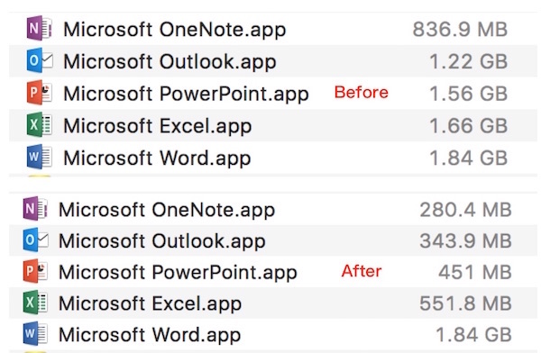

# OfficeThinner
Save your disk space with Office 2016 for Mac by symlinking common files.

Nearly 3.7GB HDD/SDD space can be saved.



## Attention!
- This script is *only* intended for *Office 2016* for Mac, tested with these versions:
  - 15.16 (151105)
  - 15.17 (151206)
- Use at your own risk. This script comes with **absolutely no warranty**.
- Read the code before you run.
- Make sure all the 5 Office Apps are in the *same* version.

## Usage
```Bash
curl -s https://git.io/v0zB6 | bash # -- [args]...
```

- As Microsoft Office 2016 for Mac is installed with `root` on `/Applications`, you have to run this script with `sudo`.
- The backup files are located at `~/Desktop/OfficeThinner`, you can do whatever you like with them if everything is fine.
- Everytime after you install Microsoft Office Updates, you may have to re-run this script. 

## Rationale
Some large-sized duplicate files exist in `Word.app`, `Excel.app`, `PowerPoint.app`, `Outlook.app` and `OneNote.app` in Office 2016 for Mac.

It's wasting your precious HDD/SSD space as these files are just 5 duplicate copies in these apps.

This script moves the following duplicate files from Excel, PowerPoint, Outlook and OneNote into a backup directory on your desktop (you may later delete them safely), and then symlink neccesary paths back to the real files in Word.app alone.

Directories we are interested in so far:

- `/Contents/Resources/Fonts`  (found in <=15.16)
- `/Contents/Resources/DFonts` (found in >=15.17)
- `/Contents/SharedSupport/Proofing Tools`
- `/Contents/Frameworks/MicrosoftOffice.framework/Versions/A/Resources`
